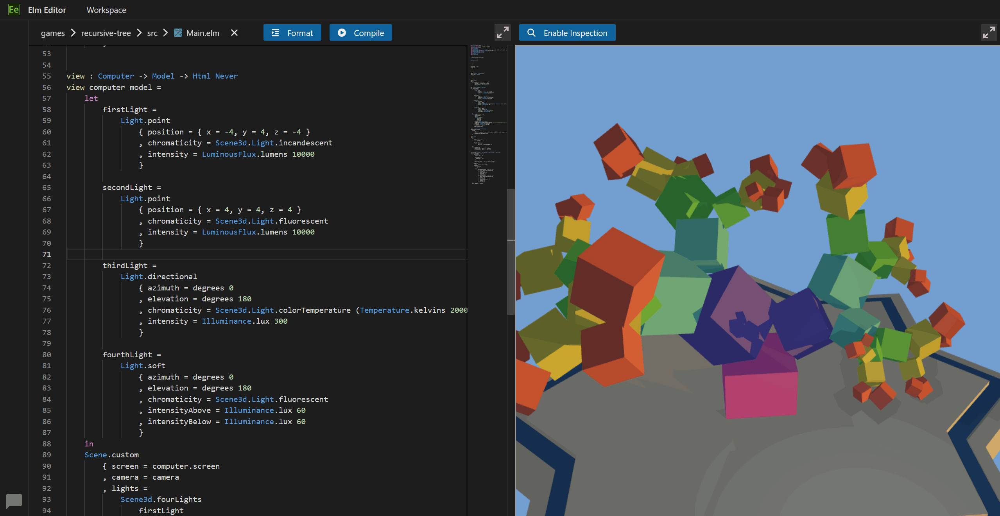

# Pine

Pine is an Elm development toolchain and runtime built on .NET. It combines editor tooling, compilation and testing tools, and hosting for Elm web services.

At its core is the [Pine language](./guide/pine-language.md), a side-effect-free compilation target designed for meta-programming. Frontend compilers translate Elm into Pine expressions, which the .NET runtime evaluates. Hosting infrastructure manages external interactions and persistence of application state.

The repository includes:

+ Elm language server and [VS Code extension](https://marketplace.visualstudio.com/items?itemName=Pine.pine).
+ [Elm Editor](https://elm-editor.com) cloud IDE.
+ .NET-based virtual machine and runtime for programs without side-effects.
+ Tools to build Elm apps and compile to Pine code.
+ CLI tools to format Elm code and run Elm tests.
+ Web server, database management system and admin interface for Elm-based web services.

## Getting Started

+ **Develop Elm in VS Code:** install the [Pine extension](https://marketplace.visualstudio.com/items?itemName=Pine.pine).
+ **Try the browser IDE:** open [Elm Editor](https://elm-editor.com).
+ **Use the CLI or host an Elm web service:** follow the installation and server example below.
+ **Understand the runtime:** read the [Pine language guide](./guide/pine-language.md).

### Installing the CLI

Download the pre-built Pine binary for your platform at <https://pine.build/download>, or on the [releases page](https://github.com/pine-vm/pine/releases) on GitHub.

The `pine` executable file integrates all functionality to build apps and operate web services.

After extracting the download, run `./pine install` from its directory on Linux or macOS
(or `.\pine.exe install` on Windows). On Linux and macOS this installs a copy in
`~/.local/bin` without administrator rights. If that directory is not on your `PATH`,
the command prints the shell setup needed to use `pine` from any directory.
Put `~/.local/bin` before older Pine installations on `PATH` if you have one.
On Windows, the command adds the extracted executable's directory to your user `PATH`;
keep that directory in place after installing.

### Running an Example App

The command below runs a server and deploys a full-stack web app:

```txt
pine  run-server  --public-urls="http://*:5000"  --deploy=https://github.com/pine-vm/pine/tree/3a5c9d0052ab344984bafa5094d2debc3ad1ecb7/implement/example-apps/docker-image-default-app
```

Once the server has started, open <http://localhost:5000/> to see the example app's landing page. Press `Ctrl+C` to stop the server.

This command does not configure persistent storage. For deployment and persistence options, see [Configuring and deploying an Elm backend app](./guide/how-to-configure-and-deploy-an-elm-backend-app.md).


## Docker Image

To deploy a web service in a Docker container, use the `pine-vm/pine` image from the [GitHub Container Registry](https://github.com/pine-vm/pine/pkgs/container/pine) (`ghcr.io/pine-vm/pine`). The tags are aligned with the version IDs in the CLI executable file.

For a local demonstration, bind both published ports to loopback:

```txt
docker  run  -p 127.0.0.1:5000:80  -p 127.0.0.1:4000:4000  --env "APPSETTING_adminPassword=test"  ghcr.io/pine-vm/pine
```

+ <http://localhost:5000/> serves the bundled placeholder app (container port `80`).
+ <http://localhost:4000/> serves the admin interface for deployments and application management (container port `4000`).

The admin password `test` is for this local demonstration only. Before exposing the service beyond your machine, use a strong admin password and restrict access to the admin interface. For persistent deployments, mount a Docker volume at `/pine-vm/process-store`.


## 📚 Guides

A selection of guides on popular topics:

+ [Building full-stack web apps](./guide/how-to-build-a-full-stack-web-app-in-elm.md)

+ [Building a backend or web service](./guide/how-to-build-a-backend-app-in-elm.md)

+ [Configuring and deploying an Elm backend app](./guide/how-to-configure-and-deploy-an-elm-backend-app.md)

+ [Persistence of application state](./guide/persistence-of-application-state-in-pine.md)

+ [Customizing builds with compilation interfaces](./guide/customizing-elm-app-builds-with-compilation-interfaces.md)

For an overview of all guides and documentation, see the [`guide` directory](./guide/).

## 🎥 Videos

+ Manually Applying Elm Functions On An Online Database Using Pine: <https://youtu.be/9mFjdf_ABNM>

## Example Apps

### Rich Chat Room

The [rich chat room example app](https://github.com/pine-vm/pine/tree/main/implement/example-apps/rich-chat-room) demonstrates features typically found in a chat app, such as user names, message rate-limiting, sound effects, etc.
For a detailed description of this app, see the readme file at <https://github.com/pine-vm/pine/blob/main/implement/example-apps/rich-chat-room/README.md>

### Elm Editor

[Elm Editor](https://github.com/pine-vm/pine/tree/main/implement/example-apps/elm-editor) is a web app for developing Elm programs.

As an integrated development environment, it assists us in reading, writing, and testing Elm programs and in collaborating with other developers.

<a href="https://github.com/pine-vm/pine/tree/main/implement/example-apps/elm-editor/README.md">

</a>

To see Elm Editor in action, check out the public instance at https://elm-editor.com

To learn more about Elm Editor, see <https://github.com/pine-vm/pine/tree/main/implement/example-apps/elm-editor/README.md>

### More Examples

For more example apps, see the [`example-apps` directory](./implement/example-apps/)
