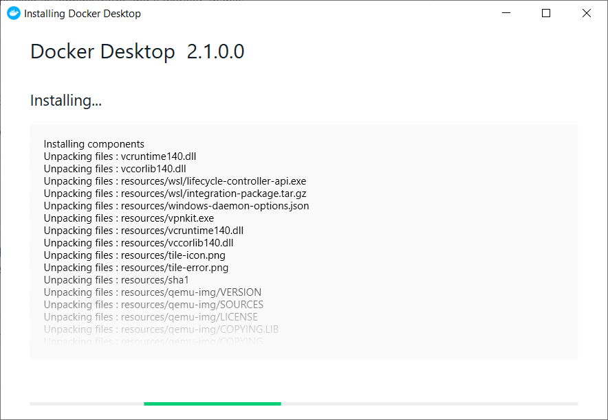
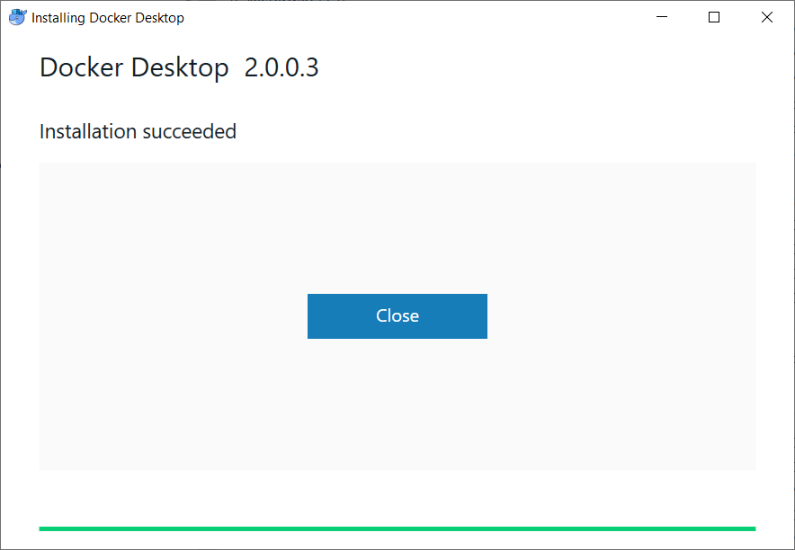
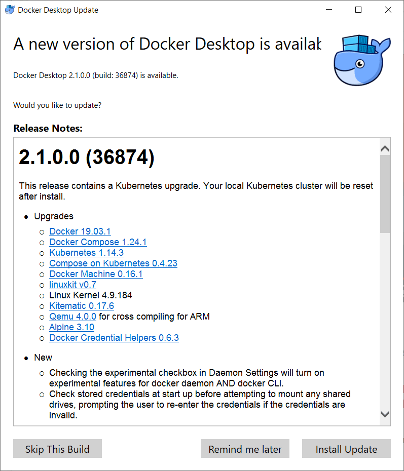

# 2019-07-31 Support Docker

Installing `Docker Desktop 2.1.0.0` is hanging on Windows 10 `Version 1903`. The installer window does not indicate any progress for more than one hour.
Below is a screenshot of how the installer window looks:

Docker was already installed before on this machine and advertised this installer as a new version. Before starting that installation, I have used docker containers on the same machine without noticing problems.

I remember a Docker installer for an earlier version broke docker (containers did not work anymore) a few months ago.

After restarting Windows, I see docker does not work anymore. I go to the Docker website to get an installer.

The installer offered there installs version `2.0.0.3`:

After restarting Windows, docker seemed to work (again?).
Also, that popup appaered soon again:

I was curious and gave this another chance. It hung again.

I also tried another round with this approach:

Before reinstalling, remove directories `C:\Program Files\Docker\Docker` and `C:\ProgramData\DockerDesktop`.

But that did not bring a better result. For now, the solution is to stay on the version from the installer downloaded from the website and `Skip This Build` offered by the popup.

