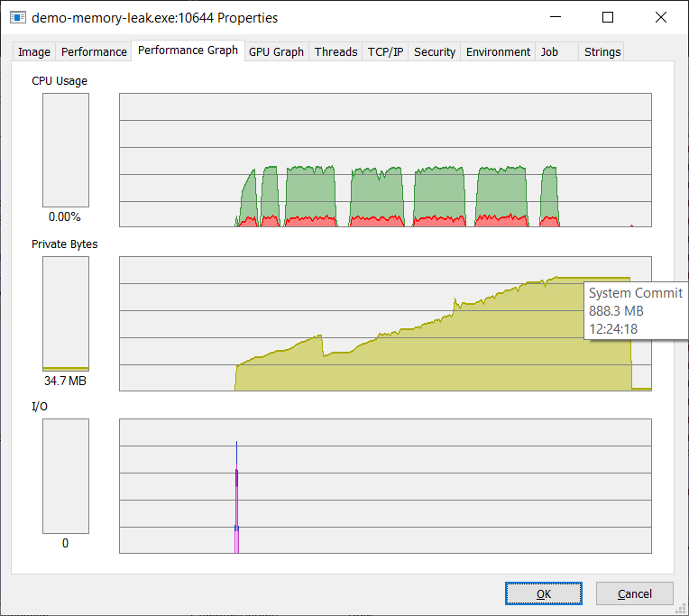
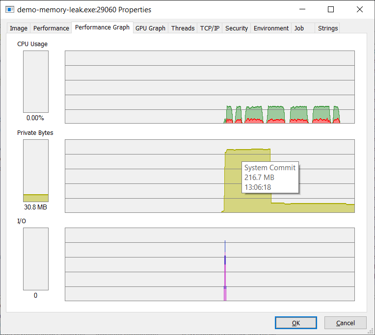

# 2020-02-02 Memory Leak

Saw growing memory usage in one application in production and restarted the server within three weeks to avoid running out of memory.

2020-02-01 Profiling session: Using the webserver: Sending one hundred thousand HTTP requests to a simple Elm app led to several MB increased memory use. Using dotMemory to take snapshots of the process and investigate: dotMemory showed only around 3.5 MB and 15 k objects used in the .NET heap, even after the 100 k requests. Comparing snapshots did not indicate any growth in the .NET heap, but showed robust growth of total memory use. These observations led to the theory that maybe this leak can be avoided by using the JavaScript engine different, or a different JavaScript engine.

The next step is to see if we can reproduce the problem with a simplified demo app. If the problem is in the use of the JavaScript engine, it should still be observable after removing the webserver and the persistence parts from the demo.

The app in the subdirectoy `demo-memory-leak` implements this setup, derived from the 'Echo' automated test. It sends 15 batches of 200 k events into the Elm app. The output using the runtime from January show the memory leak is also present in this simple scenario:

```terminal
Completed batch 0 of 15 in 18506 ms, lastEventResponse: 200000
Memory use: Process private memory / MB: 286
Press any key to continue.
Completed batch 1 of 15 in 19284 ms, lastEventResponse: 400000
Memory use: Process private memory / MB: 345
Press any key to continue.
Completed batch 2 of 15 in 19387 ms, lastEventResponse: 600000
Memory use: Process private memory / MB: 410
Press any key to continue.
Completed batch 3 of 15 in 19310 ms, lastEventResponse: 800000
Memory use: Process private memory / MB: 463
Press any key to continue.
Completed batch 4 of 15 in 19169 ms, lastEventResponse: 1000000
Memory use: Process private memory / MB: 333
Press any key to continue.
Completed batch 5 of 15 in 20279 ms, lastEventResponse: 1200000
Memory use: Process private memory / MB: 408
Press any key to continue.
Completed batch 6 of 15 in 20669 ms, lastEventResponse: 1400000
Memory use: Process private memory / MB: 468
Press any key to continue.
Completed batch 7 of 15 in 20130 ms, lastEventResponse: 1600000
Memory use: Process private memory / MB: 516
Press any key to continue.
Completed batch 8 of 15 in 19665 ms, lastEventResponse: 1800000
Memory use: Process private memory / MB: 572
Press any key to continue.
Completed batch 9 of 15 in 19646 ms, lastEventResponse: 2000000
Memory use: Process private memory / MB: 621
Press any key to continue.
Completed batch 10 of 15 in 19991 ms, lastEventResponse: 2200000
Memory use: Process private memory / MB: 696
Press any key to continue.
Completed batch 11 of 15 in 19879 ms, lastEventResponse: 2400000
Memory use: Process private memory / MB: 779
Press any key to continue.
Completed batch 12 of 15 in 19924 ms, lastEventResponse: 2600000
Memory use: Process private memory / MB: 834
Press any key to continue.
Completed batch 13 of 15 in 19693 ms, lastEventResponse: 2800000
Memory use: Process private memory / MB: 895
Press any key to continue.
Completed batch 14 of 15 in 19471 ms, lastEventResponse: 3000000
Memory use: Process private memory / MB: 939
Press any key to continue.
Memory use: Process private memory / MB: 36
Completed. Press any key to finish.
```



[Commit c1d3d2a01dc776804467d31421f508a68550078b](https://github.com/elm-fullstack/elm-fullstack/commit/c1d3d2a01dc776804467d31421f508a68550078b) implements a change to use the `CallFunction` API instead of `Evaluate`.

Results from the demo app show that [commit c1d3d2a01dc776804467d31421f508a68550078b](https://github.com/elm-fullstack/elm-fullstack/commit/c1d3d2a01dc776804467d31421f508a68550078b) fixed this problem, and memory usage now remains stable:

```terminal
Completed batch 0 of 15 in 12002 ms, lastEventResponse: 200000
Memory use: Process private memory / MB: 228
Press any key to continue.
Completed batch 1 of 15 in 12107 ms, lastEventResponse: 400000
Memory use: Process private memory / MB: 227
Press any key to continue.
Completed batch 2 of 15 in 12519 ms, lastEventResponse: 600000
Memory use: Process private memory / MB: 229
Press any key to continue.
Completed batch 3 of 15 in 11956 ms, lastEventResponse: 800000
Memory use: Process private memory / MB: 229
Press any key to continue.
Completed batch 4 of 15 in 11910 ms, lastEventResponse: 1000000
Memory use: Process private memory / MB: 229
Press any key to continue.
Completed batch 5 of 15 in 12158 ms, lastEventResponse: 1200000
Memory use: Process private memory / MB: 36
Press any key to continue.
Completed batch 6 of 15 in 11902 ms, lastEventResponse: 1400000
Memory use: Process private memory / MB: 36
Press any key to continue.
Completed batch 7 of 15 in 11887 ms, lastEventResponse: 1600000
Memory use: Process private memory / MB: 36
Press any key to continue.
Completed batch 8 of 15 in 12229 ms, lastEventResponse: 1800000
Memory use: Process private memory / MB: 35
Press any key to continue.
Completed batch 9 of 15 in 11954 ms, lastEventResponse: 2000000
Memory use: Process private memory / MB: 35
Press any key to continue.
Completed batch 10 of 15 in 11967 ms, lastEventResponse: 2200000
Memory use: Process private memory / MB: 35
Press any key to continue.
Completed batch 11 of 15 in 12009 ms, lastEventResponse: 2400000
Memory use: Process private memory / MB: 35
Press any key to continue.
Completed batch 12 of 15 in 11874 ms, lastEventResponse: 2600000
Memory use: Process private memory / MB: 35
Press any key to continue.
Completed batch 13 of 15 in 11919 ms, lastEventResponse: 2800000
Memory use: Process private memory / MB: 35
Press any key to continue.
Completed batch 14 of 15 in 12167 ms, lastEventResponse: 3000000
Memory use: Process private memory / MB: 35
Press any key to continue.
Memory use: Process private memory / MB: 32
Completed. Press any key to finish.
```



