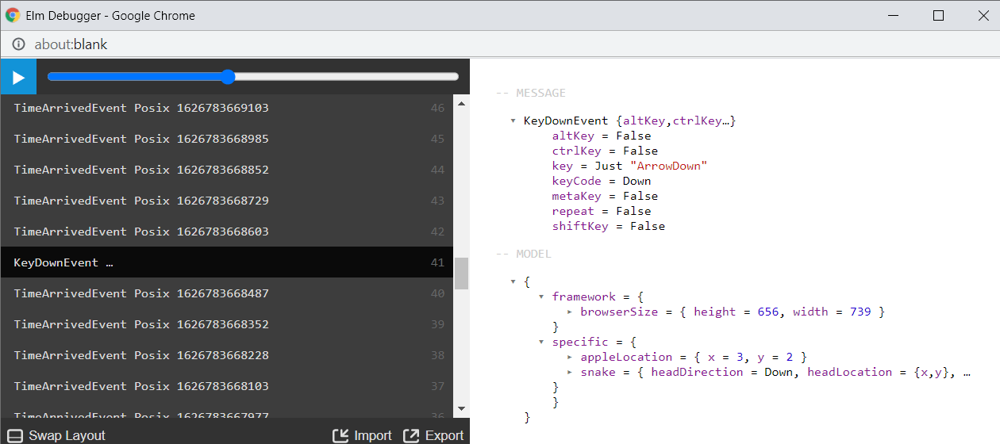

# 2021-07-20 Functional Design and User Interfaces for Inspection

Today, I felt uneasy not having a clear image of how interfaces to the runtime/host look. I guess it is a fear that changes in this area will require expensive adaptions in downstream projects. To better understand how the interface(s) work, I now describe one possible design here.

I am looking at the 'Elm Debugger' from Elm 0.19.1 for inspiration. Below is a screenshot of that UI, started from the [snake game example project](https://github.com/onlinegamemaker/making-online-games/tree/fa8cd9ba6d013a2b8dc19cf449796c224f4ab96c/games-program-codes/simple-snake):



Why use this as a reference? I see it is a kind of gating/filter for candidate designs: It seems pointless to continue with a design that does not support at least as good a view for inspection.

So here's the design of the day:
We model the evolution of the app state ('history') as an expression with nested function applications.
The last argument to those applications has the type that models the app state.
For easier viewing, the inspection tool UI arranges the representations of the functions into a list, as seen in the screenshot above.
Also seen in the screenshot above, the UI omits the value of the last argument when rendering that list. That value is implicitly the return value of the previous application. (The index numbers on the right indicate ascending order, that is, we see the previous application below the current one.)
We can automatically derive a 'migration' event where the applied function has a return type different from the last argument type when using a typed language to represent the functions and values (e.g., Elm).
Using a type-free representation (e.g., PineVM) at the base, we might prefer tooling that considers data in the state that models a typed language on top (e.g., Elm modeled on Pine). This way, tooling can still derive and show 'migration' events eventually.

Let's look at an example. Take typical Elm, here we use a single update function in conjunction with a 'Msg' value. A more generic representation would look like this:

```text
Main.update (TimeArrivedEvent (Posix 3000))
    (Main.update (TimeArrivedEvent (Posix 2000))
        (Main.update (KeyDownEvent ...)
            (Main.update (TimeArrivedEvent (Posix 1000))
                Main.init)))
```

In this visualization mode, the indent increases with each event ('msg' in Elm terminology) in the history. Also, closing parens stack up at the end of the expression.
In the specialized visualization analogous to the screenshot, we save the space for indentation with the mentioned convention linking applications.
Also, in histories with migrations, the qualifier we see at the beginning of the function representation (`Main.update`) would not suffice: Its meaning depends on the actual program code, but that code can change with a migration. We could add a hash of the particular program code (file tree) to complete the qualification. An inspection tool that interprets some events as 'migrations', could improve readability by inserting lines representing transitions between referenced programs between the other events instead of showing the program hash again in front of each function name. This specialization in the view follows the observation from production that these migrations typically happen for less than every millionth event.

I found these two related discussions:

+ https://discourse.elm-lang.org/t/messages-purpose/6778
+ https://discourse.elm-lang.org/t/why-not-use-update-fn-state-fn-state/7037

I summarized my takeaway as follows:

> We did not yet find a good reason to keep a dedicated type for events mid-term. Short term, the limitations in tools were reasons to have an event/'msg' type.

The example above shows how to map a scenario with 'Msg' type to a more general representation of an app history in functional programming. A concrete tool can omit the `EntryModuleName.update` part as implicit if it is the same for all events (as would be the case in a Elm 0.19 `Browser` app)
