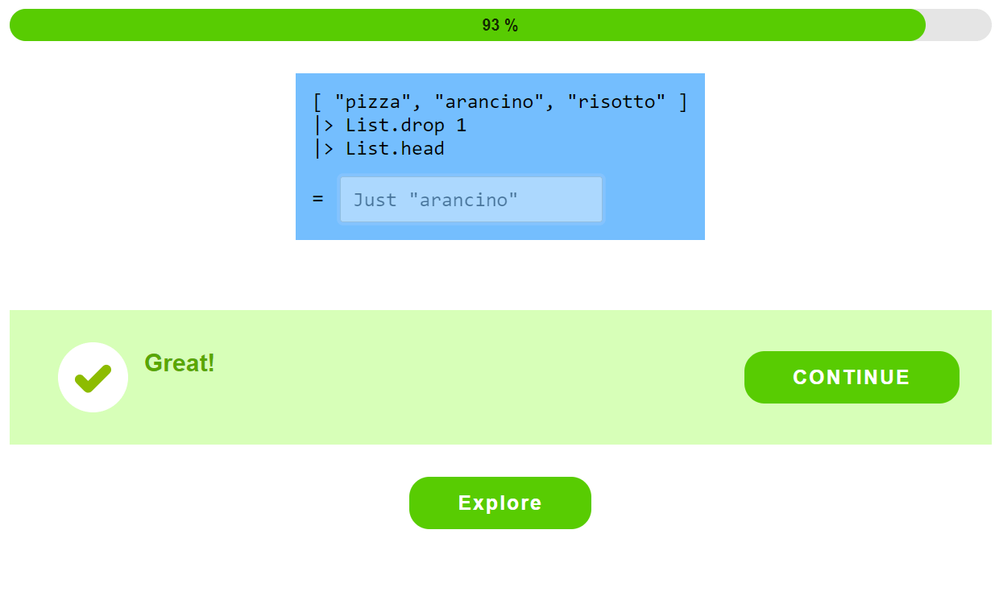

# Elm Silent Teacher

Elm Silent Teacher is a game teaching the basics of programming. Through a series of interactive quizzes, you gradually learn about the building blocks of computer programs.

The default course teaches syntax and the core library of Elm, a programming language used to build websites, games, bots, and other kinds of apps.

+ To try an example course, visit <https://silent-teacher.netlify.app/>
+ Elm Silent Teacher is open-source; you can find the code at <https://github.com/elm-time/elm-time/tree/main/implement/elm-time/ElmTime/learn-elm>
+ You can modify the exercises and customize the learning path in the [`Exercise` module](https://github.com/elm-time/elm-time/blob/main/implement/elm-time/ElmTime/learn-elm/src/Frontend/ElmSilentTeacher/Exercise.elm)
+ A blog post on Elm Silent Teacher is at <https://michaelrätzel.com/blog/elm-silent-teacher-an-interactive-way-to-learn-elm>
