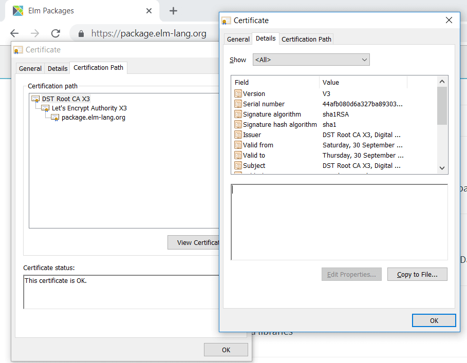

## Operating On Azure

Parts of the implementation depend on the elm executable. This section contains solutions to problems observed when the elm executable was used in an Azure Web App.

### Elm Make Fails With 'No Store'

Elm failed with following output:
```standardoutput
name-used-to-execute-file.exe: no store
CallStack (from HasCallStack):
  error, called at .\System\X509\Win32.hs:56:31 in x509-system-1.6.6-KPlAgjlEOhtBXlrzCCJ22B:System.X509.Win32
```

This error went away after changing application settings in the Azure web app as follows:
Set `WEBSITE_LOAD_CERTIFICATES` to `*`, as described at https://azure.microsoft.com/en-us/blog/using-certificates-in-azure-websites-applications/

### Elm Make HTTPS Certificate Problem

When using `elm make` with a command line like this:
```cmd
elm make StringBuilderWebApp.elm
```

It failed with the following output:
```
-- HTTP PROBLEM ----------------------------------------------------------------

The following HTTP request failed:

    <https://package.elm-lang.org/all-packages>

Here is the error message I was able to extract:

    HttpExceptionRequest Request { host = "package.elm-lang.o
rg" port = 443
    secure = True requestHeaders =
    [("User-Agent","elm/0.19.0"),("Accept-Encoding","gzip")] path =
    "/all-packages" queryString = "" method = "GET" proxy = Nothing rawBody =
    False redirectCount = 10 responseTimeout = ResponseTimeoutDefault
    requestVersion = HTTP/1.1 } (InternalException (HandshakeFailed
    (Error_Protocol ("certificate has unknown CA",True,UnknownCa))))
```

#### Solution

(From the discussion at https://discourse.elm-lang.org/t/how-to-solve-elm-make-https-certificate-problem/2546/5?u=viir)

Looks like I got it working by installing a certificate.
I downloaded the certificate from package.elm-lang.org and added it as a `Public Certificate` to the Azure app.

I used the export UI of the chrome browser to get a `.cer` file for a certificate on the path displayed in the chrome browser (I took the `DST Root CA X3` from the root)

 

The import of this file went without error messages.


But at first, the elm make command still displayed the `certificate has unknown CA` error.
Yesterday, it was too late to continue investigating, and now after coming back it works, elm make produces the output file. I don't know what happened in the meantime, maybe the host system was restarted.

While setting the certificate up, I also found this guide helpful to check if the certificate was loaded: https://blogs.msdn.microsoft.com/karansingh/2017/03/15/azure-app-services-how-to-determine-if-the-client-certificate-is-loaded/

### Elm Make Fails On `getAppUserDataDirectory`

When trying to use the elm executable with the `make` command, it failed with output like this:
```standard-output
elm.exe: getAppUserDataDirectory:sHGetFolderPath: illegal operation (unsupported operation)
```

More information about the problem is found at http://hackage.haskell.org/package/directory-1.3.3.1/docs/System-Directory.html#v:getAppUserDataDirectory :

> The argument is usually the name of the application. Since it will be integrated into the path, it must consist of valid path characters.  
>  
> + On Unix-like systems, the path is ~/.<app>.  
> + On Windows, the path is %APPDATA%/<app> (e.g. C:/Users/<user>/AppData/Roaming/<app>)  
> Note: the directory may not actually exist, in which case you would need to create it. It is expected that the parent directory exists and is writable.  
>  
> The operation may fail with:  
>  
> + `UnsupportedOperation` The operating system has no notion of application-specific data directory.  
> + `isDoesNotExistError` The home directory for the current user does not exist, or cannot be found.

As Markus Laire points out [on the elm-lang forum](https://discourse.elm-lang.org/t/how-to-get-around-elm-make-error-on-getappuserdatadirectory/2551/2?u=viir), for the special case of elm, this problem can be avoided by setting `ELM_HOME` for the elm make process. This approach made it possible to fix the problem in the framework implementation, so that no setup is required to account for this.

