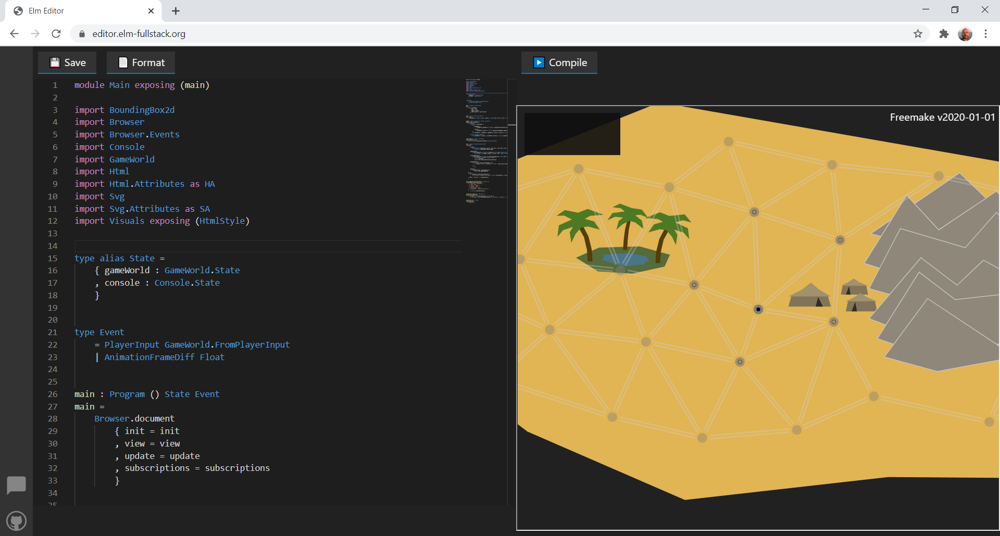

# Elm Editor

The [Elm Editor](https://github.com/elm-fullstack/elm-fullstack/tree/main/implement/example-apps/elm-editor) is an integrated development environment for building Elm apps.

To see the editor in action, you can test the public instance at https://elm-editor.com

This project evolved to help newcomers get started with minimal friction and is optimized for trainers and students.

The user interface also supports:

+ Viewing and editing all Elm module files and the `elm.json` file.
+ Check for Elm compiler errors using the chosen Elm module as the entry point.
+ Saving and sharing the current state of a project, including all code files.
+ Importing complete projects from public git repositories, also from subdirectories.
+ For frontend apps, viewing and testing the compiled web app in an iframe.

The Elm Editor frontend integrates the [Monaco Editor](https://microsoft.github.io/monaco-editor/) to provide functionality around code editing and features like syntax highlighting.

## Saving and Sharing Project States

The 'Save or Share Project' dialog helps to persist or share the whole state of a project, including all files. This user interface encodes the project state in a URL for easy sharing in mediums like chat rooms and websites.

### Anatomy of the Project Link URL

The URL we get from the UI contains three components:

+ A description of the tree structure containing the files. This description can have different shapes, as described in the 'Project State Models' section below.
+ A hash of the file tree structure. This redundant information allows the editor to check for defects in the file tree and warn the user if necessary.
+ The path of the file that should is currently opened in the code editor. When a user enters the project using the link, the editor opens this file again.

### Project State Models

The model describing the files in a project is optimized for typical training scenarios. Users often enter a project with a state as already modeled in a subdirectory in a git repository. Using an URL to a git tree in hosting services like GitHub or GitLab is sufficient to describe the project state. The editor then contacts the corresponding git hosting service to load the git repository contents. While loading is in progress, the user sees a message informing about the loading operation.

An example of such an URL to a git tree is https://github.com/onlinegamemaker/making-online-games/tree/7b0fe6018e6f464bbee193f063d26c80cc6e6653/games-program-codes/simple-snake

The corresponding URL into the editor looks like this:
https://elm-editor.com/?project-state=https%3A%2F%2Fgithub.com%2Fonlinegamemaker%2Fmaking-online-games%2Ftree%2F7b0fe6018e6f464bbee193f063d26c80cc6e6653%2Fgames-program-codes%2Fsimple-snake

When a user started with a state from a git tree and made some changes, generating a link will encode the project state as the difference relative to that git tree. This encoding often leads to much smaller URLs. Like in the case of a pure git URL, the editor loads the base from the third-party service. When the loading from git is complete, the app applies the changes encoded with the URL on top to compute the final file tree.

